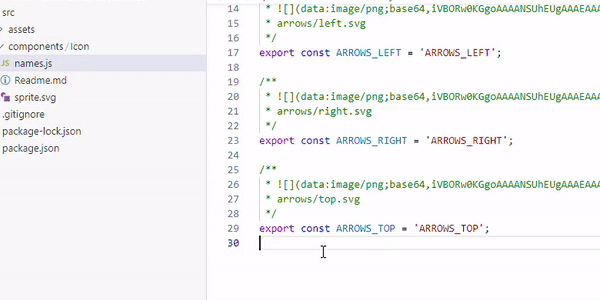

# CLI for generate svg-sprite for Reactjs projects

[](https://www.npmjs.com/package/react-svg-sprite-generator)

## Install:
```bash
npm i --save-dev react-svg-sprite-generator
```

**Run**:
```bash
svgsprite --src ./assets/icons --dest ./src/components/Icon
```

**Run without installation (with npx)**:
```bash
npx react-svg-sprite-generator  --src ./assets/icons --dest ./src/components/Icon
```

## **Overview**

The **react-svg-sprite-generator** is a library specifically designed for React.js applications. It aids in generating SVG sprites from a directory of SVG files.

### Image Preview in an Autocomplete



The unique feature of the generated names.js is the inclusion of inline Base64 encoded previews of the SVG icons.
This means that in certain IDEs with markdown preview or image tooltip capabilities, you can actually hover over
the constant or view the names.js file to see a visual representation of the corresponding icon.

**Autocomplete** in IDEs **VSCode** and **Webstorm** will show a small image preview of the icon.
This visual feedback is invaluable when you're trying to pick the right icon for a specific context in your application.

## **How to Use**

### Setting up Source Files

Place your SVG icons in a directory. By default, the library looks for SVG files in the **./src/assets/icons** directory.

For example, let's consider the following structure:

```css
src  
└── assets  
   └── icons
      └── group1
         ├── icon1.svg  
         └── icon2.svg
```

### Running the Generator

Execute the command from your terminal:

```bash
svgsprite
```

If you wish to specify a different source or destination directory, you can use the **\--src** and **\--dest** arguments respectively:

```bash
svgsprite --src ./path/to/your/svg/directory --dest ./path/for/generated/files
```

### Generated Files Structure

After the execution, the default directory where the generated files will be placed is **./src/components/Icon**.

This will generate:

*   A combined SVG sprite (**sprite.svg**)
*   A JavaScript file with the names of your icons (**names.js**)
*   A markdown file for documentation (**Readme.md**)

For our example with **icon1.svg** and **icon2.svg**, the directory will look something like this:

```css
src
└── components
    └── Icon
        ├── sprite.svg
        ├── names.js
        └── Readme.md
```

### Understanding the Generated Files

**sprite.svg:**

```xml
<svg xmlns="http://www.w3.org/2000/svg" style="display: none;">
    <symbol id="GROUP1_ICON1" viewBox="0 0 24 24">
        <!-- SVG content of icon1.svg -->
        <path d="..."></path>
        <!-- ... other SVG elements of icon1.svg ... -->
    </symbol>
    <symbol id="GROUP1_ICON2" viewBox="0 0 24 24">
        <!-- SVG content of icon2.svg -->
        <path d="..."></path>
        <!-- ... other SVG elements of icon2.svg ... -->
    </symbol>
</svg>
```

**names.js**: This file exports constant names for each SVG icon. The naming convention transforms the icon's file path and name to an uppercased version replacing non-alphanumeric characters with **\_**.

For instance, for our two icons, the **names.js** might look like:

```javascript
/**
 *   
 * group1/icon1.svg
 */
export const GROUP1_ICON1 = 'GROUP1_ICON1';

/**
 *   
 * group1/icon2.svg
 */
export const GROUP1_ICON2 = 'GROUP1_ICON2';
```

**Readme.md**: This file provides a markdown table which visually presents each icon, its name (as defined in **names.js**), and its original path.

For our example icons, the **Readme.md** will look like:

```plaintext
| Icon                                   | Name          | Path            | Source                   |
|----------------------------------------|---------------|-----------------|--------------------------|
| <svg width="24" height="24" ....>      | GROUP1_ICON1  | group1/icon1.svg| |
| <svg width="24" height="24" ....>      | GROUP1_ICON2  | group1/icon2.svg| |
```

### Usage in React

```tsx
import * as IconNames from './names.js';
import spriteUrl from './sprite.svg';

const Icon: IconType = ({ name:  keyof typeof IconNames }) => {
	return (
		<svg>
			<use xlinkHref={`${spriteUrl}#${name}`} />
		</svg>
	);
};
export default Icon;

```

```javascript
import * as IconNames from './names.js';
import Icon  from './Icon.js';

<Icon name={IconNames.ICON1} />

```

### **Conclusion**

The **react-svg-sprite-generator** is a powerful tool for managing SVG icons in React projects. It streamlines the process of creating sprites and provides an easy-to-reference documentation for developers.
